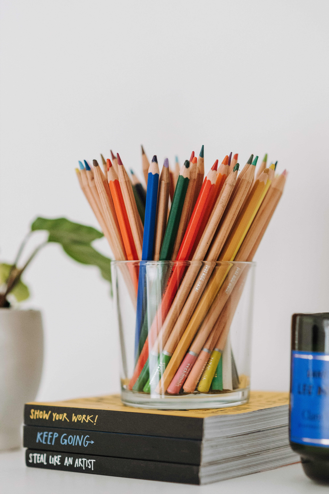

<html>
	<head>
		
	</head>
	<body>
		

			<!---img logo--->
			<!---LISTADO DE CATEGORÍAS-->
			
<b style="font-size: 18px">Categorías</b>

			<ul class="nobullets"> <!---listado de categorías--->
				<li><input type="checkbox" id="tecnologia" value="tecnologia">Tecnología</li>
				<li><input type="checkbox" id="deportes" value="deportes">Deportes</li>
				<li><input type="checkbox" id="electrodomesticos" value="electrodomesticos">Electrodomésticos</li>
				<li><input type="checkbox" id="juguetes"  value="juguetes">Juguetes</li>
				<li><input type="checkbox" id="libros" value="libros">Libros</li>
				<li><input type="checkbox" id="farmacia" value="farmacia">Farmacia</li>
				<li><input type="checkbox" id="comestibles" value="comestibles">Comestibles</li>
				<li><input type="checkbox" id="bebes" value="bebes">Bebés</li>
			</ul>
		

		

				
 ENG | USD

				

AnzoShop

 <!---div de título--->
			<!---MENU --->
			

			  <a class="limenu" href="#home">Inicio</a>
			  <a class="limenu" href="#compra">Compra</a>
			  <a class="limenu" href="#vende">Vende</a>
			  <a class="limenu" href="#contacto">Contacto</a>
			

			 
			

				
			

			

				
				
			

		

		
		

Otras categorías

		

		

				

								

					<b>Zapatillas Deportivas</b>
					
<s><b>$89.99</b></s>

<b>-30%</b>

				

			

			

				

								

					<b>Botella de Vino</b>
					
<s><b>$59.99</b></s>

<b>$45.00</b>

				

			

	
			

				

								

					<b>Kit de Libros</b>
					
<s><b>$199.99</b></s>

<b>$138.99</b>

				

			

			

				

								

					<b>Franela</b>
					
<s><b>40.99</b></s>

<b>35.99</b>

				

			

			

				

				

					<b>Kit de Maquillaje</b>
					
<s><b>$15.99</b></s>

<b>$13.80</b>

				
				
			

			

				

								

					<b>Anticonceptivos</b>
					
<s><b>$49.99</b></s>

<b>$35.00</b>

				

			

			

				

								

					<b>Cafetera Moderna</b>
					
<s><b>$199.00</b></s>

<b>$120.99</b>

				

			

			

				

								

					<b>Útiles Escolares</b>
					
<s><b>9.99</b></s>

<b>7.99</b>

				

			

		

		

		

			 
			
 
			

				

				

					Todos los departamentos 
					Directorio de Tiendas 
					Términos de uso  
				

				

					¿Quiénes somos? 
					Nuestro compromiso  
					Contáctanos  
				

	
				

					Preguntas frecuentas  
					Ayuda  
					Vende con nosotros  
				

				

			

			
Copyright 2023  - Todos los derechos reservados.

			

				

			
	
			
		

		
	</body>
</html>
